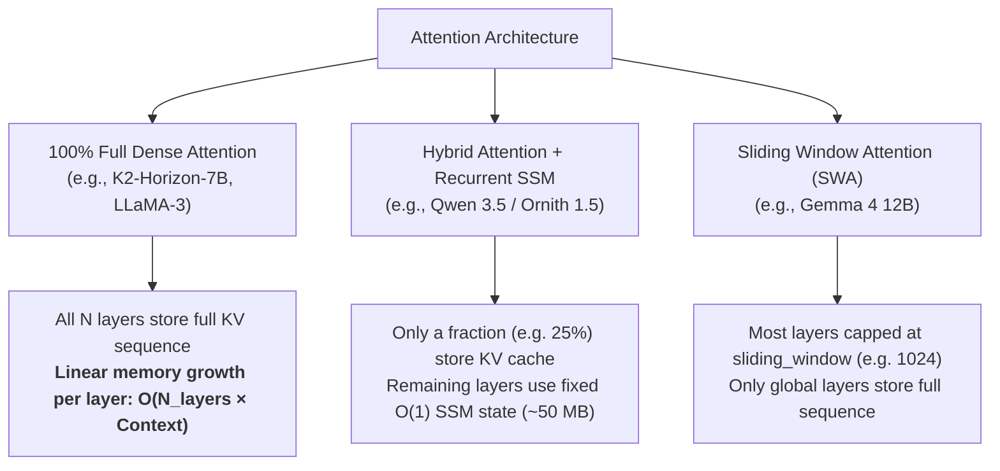

# KV Cache Scaling Across Attention Architectures: Why "7B" Can Outgrow 9B and 12B VRAM

This guide documents the mathematical and architectural mechanisms behind inference memory scaling on consumer GPUs (such as discrete 8 GB-class cards). It explains why nominal parameter labels ("7B", "9B", "12B") can be misleading and demonstrates how modern attention mechanisms determine whether a model fits in VRAM or collapses into Windows WDDM PCIe paging.

---

## 1. The Total Inference Memory Equation

Total VRAM consumption during inference is governed by:

$$\text{Total VRAM} = \text{Model Weights} + \text{KV Cache Memory} + \text{State / Working Buffers} + \text{CUDA Runtime Overhead}$$

When context length scales to 32k, 65k, or 131k tokens, **KV Cache Memory frequently surpasses Model Weight size as the dominant driver of VRAM consumption**. If total allocation exceeds physical VRAM, the operating system (e.g. Windows WDDM) spills pages into system RAM over PCIe, reducing prompt processing speeds by **100× to 170×** (e.g., from 2,000 t/s to ~12 t/s).

---

## 2. The Nominal Parameter Fallacy: Tied vs. Untied Vocabularies

Model names (e.g., "7B") typically reflect the size of the transformer backbone, not necessarily the total resident parameter count:

* **Tied Embeddings (`tie_word_embeddings: true`):** The token embedding matrix (`tok_embd.weight`) and output projection matrix (`output.weight`) share the exact same tensor in memory. For a 32,000 vocabulary at hidden dimension 4,096:
  $$\text{Embedding Params} = 32,000 \times 4,096 \approx 131\text{ Million params}$$
* **Untied 250k Vocabularies (`tie_word_embeddings: false`):** Modern multilingual and code-centric models often use large vocabularies (e.g., 250,624 tokens) with separate input and output projection weights:
  $$\text{Embedding Params} = 2 \times (250,624 \times 4,096) = \mathbf{2,053,111,808\text{ params (~2.05 Billion)}}$$

### Case Study: K2-Horizon-7B
* Transformer backbone (36 layers): **6.946 B**
* Untied embeddings: **2.053 B**
* **True Total Parameters:** **8.999 B (~9.0 Billion)**

At the parameter and weight level, K2-Horizon-7B is physically equivalent to a 9B model.

---

## 3. Attention Architecture Taxonomy & KV Scaling

The number of KV cache elements stored per token across all layers is defined as:

$$\text{Elements per Token} = \sum_{l=1}^{N_{\text{layers}}} N_{\text{kv}}^{(l)} \times \left(D_k^{(l)} + D_v^{(l)}\right)$$

Where $N_{\text{kv}}^{(l)}$ is the number of key-value heads and $D_k, D_v$ are head dimensions for layer $l$.

### A. 100% Full Dense Attention (K2-Horizon-7B)
* Every layer calculates quadratic cross-token attention.
* 36 layers $\times$ 8 KV heads $\times$ 256 (128 K + 128 V) = **73,728 elements/token**.
* At `q4_0` (0.5625 bytes/element): **41,472 bytes/token (40.50 KiB/token)**.
* **KV Cache at 65,536 tokens:** **2,592 MiB (2.53 GiB)**.

### B. Hybrid Attention + Gated DeltaNet SSM (Ornith-1.5-9B, Qwen3.8-9B)
* Architecture specifies `full_attention_interval = 4`:
  - **8 layers** execute full attention ($8 \times 4 \times 512 = \mathbf{16,384\text{ elements/token}}$).
  - **24 layers** are linear recurrent SSM layers. Their state is constant ($O(1)$ memory, totaling **~51.5 MB** across the entire model).
* At `q4_0`: $16,384 \times 0.5625 = \mathbf{9,216\text{ bytes/token (9.00 KiB/token)}}$.
* **KV Cache at 65,536 tokens:** **576 MiB (0.56 GiB)** + 51.5 MB SSM state.
* **Efficiency:** **4.50× smaller** KV cache footprint than full dense attention.

### C. Sliding Window Attention (Gemma 4 12B)
* Architecture specifies `sliding_window = 1024` with pattern `[1, 1, 1, 1, 1, 0]`:
  - **40 layers** only store the most recent 1,024 tokens ($40 \times 1024 \times 2048 \times 0.5625 = 45.0\text{ MiB}$).
  - **8 layers** store global sequence history ($8 \times 65536 \times 2048 \times 0.5625 = 576.0\text{ MiB}$).
* **KV Cache at 65,536 tokens:** **621 MiB (0.61 GiB)**.
* **Efficiency:** **4.17× smaller** KV cache footprint than full dense attention.

---

## 4. Cross-Family Architectural & Memory Matrix

| Metric | K2-Horizon-7B | Ornith-1.5-9B | Qwen3.8-9B | Gemma-4-12B |
| :--- | :--- | :--- | :--- | :--- |
| **Model Size Label** | 7B | 9B | 9B | 12B |
| **Physical Parameters** | **8.999 B** | **~8.98 B** | **~8.2 B** | **~12.0 B** |
| **Attention Type** | Full Dense MHA | Hybrid SSM + Attn | Hybrid SSM + Attn | SWA (5:1) + Global |
| **Total Layers** | 36 | 32 (+ 1 MTP) | 32 | 48 |
| **Full Attention Layers** | **36 (100%)** | **8 (25%)** | **8 (25%)** | **8 (16.7%)** |
| **Recurrent / SSM Layers** | 0 | 24 ($O(1)$) | 24 ($O(1)$) | 0 |
| **Sliding Window Layers** | 0 | 0 | 0 | 40 (capped @ 1024) |
| **KV Elements / Token** | **73,728** | **16,384** | **16,384** | **17,664** (effective) |
| **KV Scaling Rate (`q4_0`)** | **40.50 KiB / tok** | **9.00 KiB / tok** | **9.00 KiB / tok** | **9.70 KiB / tok** |
| **KV Cache @ 65k (`q4_0`)** | **2,592 MiB (2.53 GiB)** | **576 MiB (0.56 GiB)** | **576 MiB (0.56 GiB)** | **621 MiB (0.61 GiB)** |
| **Model Weights (Quantized)** | 5.33 GB (Q4_K_M) | 5.63 GB (Q4_K_M) | 5.20 GB (IQ4_XS) | 5.80 GB (Q3_K_M) |
| **Total Peak VRAM @ 65k** | **8.37 GB (OOM / Spills)** | **7.01 GB (Fits 8 GB)** | **6.43 GB (Fits 8 GB)** | **7.01 GB (Fits 8 GB)** |

---

## 5. Practical Guidelines for 8 GB Hardware

1. **Check the Attention Mechanism Before Setting `--ctx-size`:**
   - **Hybrid SSM (Qwen 3.5 / Ornith 1.5):** 65k and 100k context fit easily on 8 GB cards because 75% of layers use constant-size SSM states.
   - **Sliding Window (Gemma 4):** 65k and 131k context fit on 8 GB cards (especially at Q3_K_M) because 83% of layers cap KV cache at 1,024 tokens.
   - **Full Dense Attention (K2-Horizon, LLaMA-3):** Context should be capped at **32,768 tokens** on 8 GB GPUs. Setting 65k context guarantees VRAM oversubscription and PCIe paging.
2. **Formula for Maximum Safe Context on Dense Models:**
   $$\text{Max Safe Ctx} = \frac{(\text{GPU VRAM} - \text{Weight Size} - \text{CUDA Overhead}) \times 1024 \times 1024}{\text{KV Bytes per Token}}$$
   For K2-Horizon-7B with 5.33 GB weights on an 8.0 GB card (~1.9 GB available):
   $$\frac{1,900 \times 1024 \times 1024}{41,472} \approx \mathbf{48,000\text{ tokens maximum ceiling (32,768 safe operational baseline)}}$$
3. **Low-Precision KV Mitigation:**
   - For dense models requiring 65k context on 8 GB cards, serve with 2-bit or TurboQuant KV cache (`-ctk tq2_0 -ctv tq2_0` or `turbo2`), cutting KV footprint by 4× (down to ~10.1 KiB/token).
