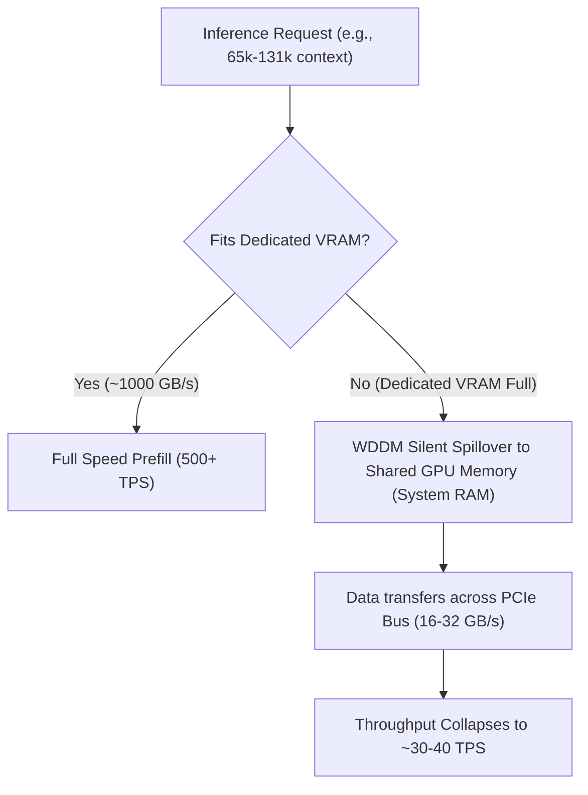

# Windows WDDM VRAM Spillover & Long-Context Degradation

## 1. Overview

A recurring failure mode on Windows GPU inference (NVIDIA WDDM driver architecture) occurs during long-context agent sessions (e.g. 32k–131k tokens) or immediately following agent context compaction:
**Prompt processing throughput collapses by 10×–15× (typically falling from 500+ TPS down to ~30–40 TPS)**, and often appears to persist even after starting a new context or attempting to restart the server.

This document details the root causes, the hardware/driver mechanics, diagnostic commands, and concrete mitigation steps.

---

## 2. The Mechanics: WDDM Dedicated vs. Shared GPU Memory

Unlike Linux where CUDA immediately raises `cudaErrorMemoryAllocation: out of memory` (OOM) when physical VRAM is exhausted, Windows manages GPU memory via the **Windows Display Driver Model (WDDM)** and NVIDIA's **Sysmem Fallback Policy**.



### The Bandwidth Bottleneck
* **Dedicated VRAM Bandwidth:** 300 to 1,008 GB/s (GDDR6/GDDR6X).
* **PCIe Bus Bandwidth:** 16 to 32 GB/s (PCIe 4.0/5.0 x16).

When model weights or the active KV cache exceed dedicated VRAM by even a few hundred megabytes, WDDM transparently allocates the excess pages into **Shared GPU Memory** (system RAM). Every attention prefill computation touching those pages must traverse the PCIe bus, instantly bottlenecking execution throughput to ~30–40 TPS.

---

## 3. Why It Triggers on Compaction in Coding Agents

Agent harnesses (such as `pi`, `opencode`, `claude-code`) manage session history as it grows:
1. **Context Expansion:** As tools and outputs accumulate, the prompt reaches long context (e.g., 32k, 64k, 98k tokens).
2. **The Compaction Trigger:** When the agent hits a threshold, it runs a summarization pass over the entire historical window (evaluating 60k–98k tokens in a single request).
3. **Peak Memory Spike:** Generating the summary and restructuring the context pushes VRAM usage to peak limits.
4. **Prefix Invalidation:** The post-compaction context replaces the history with a summary message. Because the prefix tokens after the system prompt no longer match the old cache, `llama-server` must prune and evaluate a large new block. If the KV cache is unquantized (`f16`), this creates a sudden VRAM allocation burst that pushes the process into Shared GPU Memory.

---

## 4. The "Persistence" Illusion: Why Restarting Doesn't Fix It

Operators frequently report that *"even starting a new chat or restarting the server remains slow."* This is caused by two distinct issues:

### A. The Orphaned Process (Zombie `llama-server.exe`)
On Windows, terminating a terminal, shell, or wrapper script (e.g., pressing `Ctrl+C` or closing a console window) often terminates only the parent shell, leaving the child `llama-server.exe` running in the background.
* The zombie process continues holding 100% of its dedicated VRAM allocations (e.g., 5–7 GB).
* When the operator launches a "new" server, WDDM sees zero free dedicated VRAM.
* Instead of failing, WDDM places the **entire new server into Shared GPU Memory (System RAM)** from token zero!
* Result: The new server runs at 40 TPS on the very first prompt.

### B. Thermal Throttling Latency
Sustained 98k token prefill at 500 TPS places continuous high-power compute load on GPU tensor cores and memory modules.
* If memory junction or hotspot temperatures hit safety ceilings (100°C–105°C), the GPU drops to a low performance P-state (e.g., core clocks drop from 2500 MHz to ~210 MHz).
* The driver requires cooling down before clocks restore.

---

## 5. Diagnostics & Verification Checklist

When throughput suddenly drops to ~40 TPS, run this checklist:

### 1. Check Shared GPU Memory Usage
Open Windows Task Manager $\rightarrow$ Performance $\rightarrow$ GPU, or inspect via PowerShell:
```powershell
Get-CimInstance Win32_VideoController | Select-Object Name, AdapterRAM
```
If Task Manager reports **Shared GPU Memory in use (> 0 MB)** while running inference, memory has spilled over PCIe.

### 2. Verify and Kill Zombie Server Processes
Check if orphaned server processes exist:
```powershell
Get-Process llama*
```
If multiple instances are running, terminate all instances cleanly:
```powershell
taskkill /F /IM llama-server.exe
```

### 3. Check GPU Clocks and Thermal Throttling
```powershell
nvidia-smi --query-gpu=clocks.current.graphics,temperature.gpu,throttle.reasons.active --format=csv
```
If clocks are locked around 210 MHz or thermal throttle is active, allow the GPU to cool down.

---

## 6. Sizing Rules & Prevention

Never reduce configured context (`CTX_SIZE`) to solve memory pressure ([AGENTS.md](../../AGENTS.md) § Local Contracts). Use structural memory hygiene:

1. **Quantize KV Cache (`q4_0`):**
   * Default `f16` KV cache takes **~128 KB per token** on typical architectures (e.g., 32 layers, 8 heads, 128 dim).
   * At 98k tokens, `f16` KV cache requires **12.5 GB VRAM** (guaranteed spill on 8GB/12GB cards).
   * Quantizing to `q4_0` (`--cache-type-k q4_0 --cache-type-v q4_0`) reduces this to **~32 KB per token** (~3.1 GB at 98k tokens).
2. **Cap Server Host-RAM Prompt Cache (`--cache-ram`):**
   * Upstream `llama-server` defaults to `--cache-ram 8192` (8 GiB in system RAM). On systems with 32 GB RAM running large GGUF `mmap` files, this can trigger system pagefile swapping (SSD thrashing).
   * Tune `--cache-ram` or set `--cache-ram 0` if system RAM paging occurs.
3. **Single Slot Configuration (`--parallel 1`):**
   * Multiple parallel slots multiply the preallocated KV pool unless unified KV is active. Use `--parallel 1` for dedicated local agent sessions.
